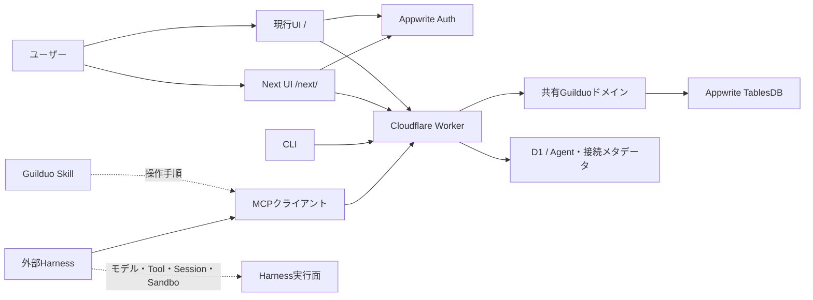

# Guilduo Project Specification

> **English summary:** Guilduo is a Human × AI Work Platform where humans and AI agents coordinate work in the same workspace. This document is the technical source of truth for product responsibilities, data contracts, authentication, synchronization, MCP boundaries, and release safety. Visual rules belong in [`DESIGN.md`](DESIGN.md); `/next/` visual differences belong in [`interaction-lab/DESIGN.md`](interaction-lab/DESIGN.md).

最終更新: 2026-08-30
対象: `0.6.0-beta.8`候補 / REST・MCP `2.7.0` / Schema `7`
文書の位置づけ: アーキテクチャ、ドメイン、API、認証、安全性、運用の正本

## 1. 目的と境界

Guilduoは、現実の作業をQuestへ変換し、HumanとAI Agentが同じworkspaceで依頼、担当、実行、Handoff、Reviewを行うためのオープンな作戦盤である。

この文書が定義するもの:

- プロダクトの思想、用語、責務境界
- 正式公開URL、`/`、`/next/`、REST、MCP、CLI、Skillの関係
- Quest、報酬、MP、Battle、Quest Tree、Handoffの不変条件
- 認証、同期、公開情報、秘密情報の扱い
- UI変更、AI連携、リリース時に守る互換性ルール

この文書が定義しないもの:

- 詳細な視覚設計、色、タイポグラフィ、コンポーネントの外観
- 外部Provider OAuthの実装詳細
- Unity Battle Labやネイティブアプリの実装
- Agentの自動起動、モデル呼び出し、Sandboxの実行
- API契約ファイルと同じ内容の重複定義

正式URLの早見表は[`docs/public-urls.md`](docs/public-urls.md)、host-based routingの契約は[`docs/appwrite-site-routing.md`](docs/appwrite-site-routing.md)を参照する。視覚設計は[`DESIGN.md`](DESIGN.md)、Next版の視覚差分は[`interaction-lab/DESIGN.md`](interaction-lab/DESIGN.md)を参照する。

視覚設計の成果物は、数値トークン[`design/TOKENS.json`](design/TOKENS.json)、部品[`design/COMPONENTS.md`](design/COMPONENTS.md)、画面[`design/SCREENS.md`](design/SCREENS.md)、アセット[`design/ASSET_MANIFEST.md`](design/ASSET_MANIFEST.md)を参照する。これらはQuestデータやAPI契約を変更しない。

## 2. プロダクトモデル

### 2.1 設計原則

1. **人間が目的と最終判断を持つ。** AIの提案、変更、レビューは確認可能にする。
2. **Questと報酬を分離する。** Quest完了でMPを得るが、Battleのコマンドとタイミングは人間が選ぶ。
3. **読む、プレビューする、実行する。** 書き込み、一括操作、Handoff、外部同期はdry-runを基本にする。
4. **削除より保管する。** 履歴、報酬、依存関係、外部リンクを保持する。
5. **人間とAIを同じパーティーに置く。** ユーザー、Astra、Agent、MCPクライアントを混同しない。
6. **データを閉じ込めない。** Web UI、REST、MCP、CLIは同じドメインルールを使う。

### 2.2 用語と責務

| 用語 | 意味 | 所有する責務 |
| --- | --- | --- |
| ユーザー | Appwriteで認証された本人 | 目的、最終判断、公開範囲、Agent設定 |
| Astra | ユーザーが選ぶ相棒キャラクター | 見た目、役職、MBTI、Battle上のキャラクター表現 |
| Agent | 作業を担当するAIの台帳エントリ | 表示名、Provider、許可スコープ、Handoff既定値 |
| MCPクライアント | ChatGPT、Codex、Claude等の接続元 | OAuth接続、利用スコープ、Agentへの紐付け |
| Party | 人間・Agentの作戦上の所属 | メンバー表示、担当Quest、レビュー関係 |
| Guilduo | データ・権限・作戦状態の管理面 | Quest、報酬、MP、Handoff、監査、同期 |
| Harness | モデルをツール付きAgentとして実行する外部面 | Model、Tool、Skill、Session、Sandbox、実行ループ |

## 3. システム構成

### 3.1 サーフェスの役割

| サーフェス | 役割 | 正式な位置づけ |
| --- | --- | --- |
| `https://app.guilduo.com/` | Guilduo / Relay ForgeのWeb App | 新規ユーザー向け正式入口・公開β |
| `/next/relay-forge/` | Relay Forgeのビルド後実装path | Appwrite Site内部path・互換入口。canonicalではない |
| `/interaction-lab/` | Interaction Labの開発・キャプチャ用source route | ローカル開発専用 |
| `/` | 現行UI、Appwrite同期、従来操作との互換 | 既存surface。公開導線はWeb Appへ集約 |
| `/next/` | Nextの互換・検証path | 新規ユーザー向けの正式入口ではない |
| `https://guilduo.com/` | Guilduo公式サイト / LP | canonical root |
| `https://guilduo.com/lp/en/` | 英語LP | 公式言語別入口 |
| `/lp/`・`/lp/en/` | Guilduoの説明、Product Proof、公開CTA | 日本語・英語の公式マーケティングSurface |
| `https://mcp.guilduo.com/mcp` | OAuth対応Remote HTTP MCP | AIクライアント向け正式endpoint |
| `https://api.guilduo.com/v1` | Appwrite API | SDK・WorkerのAPI endpoint |
| Appwrite Auth | Googleログインとユーザー識別 | 認証の基準 |
| Appwrite TablesDB | Quest・キャラクター・Battle状態 | ユーザー状態の保存先 |
| Appwrite Sites | Web/PWAとLPの静的配信 | 公開Webの配信面 |
| Cloudflare Worker | REST、OAuth、MCP、Webhook、拡張機能境界 | APIの実行面 |
| Cloudflare D1/KV | Agent、接続、プロフィール、短期OAuth状態 | Worker側メタデータ保存 |
| CLI | 人間・CI向けのREST/JSON操作 | MCPとは別の操作面 |
| Skill | AIに安全な操作順序を教える手順書 | MCPの利用ガイド |

`https://app.guilduo.com/`のrootは、同じAppwrite Siteの`/next/relay-forge/`へhost-based rewriteされる。ブラウザへ表示するcanonical URLはrootのままにし、内部pathを新規リンクへ露出させない。旧workers.dev URLとAppwrite generated domainは互換・検証・rollback用途に限定する。



### 3.2 データの正本

- Quest、キャラクター、Battle、報酬、イベントの業務ルールは共有ドメインを正本にする。
- APIの入力・出力は`api/openapi.json`、MCPのツール契約は`api/mcp-tools.json`を正本にする。
- `/`と`/next/`はAppwrite Authで本人を識別し、Worker RESTから本体スナップショットを取得する。ブラウザへAppwrite API Keyを渡さない。
- Workerは短命なAppwrite JWTを検証し、サーバー専用API KeyでTablesDBを読み書きする。`user_states`の行IDはAppwrite UIDとし、直接クライアント権限を付けない。
- `user_states`と`legacy_states`の`stateJson`は必須の`longtext`列とする。スナップショットはgzip＋Base64で保存し、旧形式のJSONも読み込める状態を維持する。旧string列を想定した60,000文字制限で通常の保存・移行を拒否しない。容量対策としてQuest、履歴、報酬、移行スナップショットを間引かず、revisionによる競合検知とトランザクションを維持する。
- Firebase移行データは`legacy_states`へ暗号学的メールハッシュをキーとして一時格納し、同じメールでの初回Appwriteログイン時に`user_states`へ一度だけ移管する。移行元は検証期間中だけロールバック用に保持する。
- Next版のローカル保存はゲスト利用、表示設定、前回スナップショットのためだけに使う。ログイン済みユーザーの本体データを別ユーザーへ表示しない。
- API、MCP、外部連携から受け取るJSONは未検証の外部入力として扱い、ドメイン境界で正規化する。
- GUIの遅延は保存確定までを測り、保存前の表示だけで成功と扱わない。認証付きREST/MCPにはリクエストごとに分離した処理時間を`Server-Timing`と`guilduo_request_timing`ログへ出力する。固定の処理名・経路分類、HTTP method/status、時間と回数のみを記録し、URL、クエリ、UID、Quest本文、認証情報、例外本文は含めない。並列・入れ子の区間は合計時間と重なるため、単純加算しない。

- Workerの実行配置は任意の`WORKER_PLACEMENT_REGION`（`provider:region`）でAppwriteの保存地域付近へ指定できる。未指定ならCloudflareの既定配置を維持する。配置調整はデータ移行ではなく、認証・保存先endpoint・トランザクション・revision照合を変更しない。対象環境の設定を空にして再配備すると元の配置へ戻せる。
- Relay Forgeのブラウザ計測は`guilduo_gui_timing`として固定の操作名と経過msのみをローカルconsoleへ出す。保存応答の検証・render後の描画機会までを測り、保存失敗・非表示タブ・破棄済み画面の成功値を記録しない。初期ロードはnavigation開始から、再接続は接続開始から測る。計測専用の外部送信は行わない。
- 本番の初期接続は、OAuth callbackのセッション交換後、Appwriteのアカウント検証と短命JWT発行を並列で開始する。JWTが先に返ってもアカウント検証の成功前には呼び出し元へ渡さない。検証失敗・サインアウト後の結果は破棄し、未検証のユーザー表示や認証検査の省略で高速化しない。

### 3.3 プロフィール画像の正本と境界


- プロフィールの表示名、handle、bio、既定のキャラクター表示、現在の画像asset参照、`avatarVersion`はCloudflare D1の`social_profiles`を正本にする。Web UIとMCPの`get_my_profile` / `update_profile`は同じ行を読む・更新する。
- Appwrite Authのemailはアカウント情報として読み取り専用で表示する。プロフィールの公開情報やMCP出力へemailを混在させない。
- 画像バイトは既存の`AGENT_AVATARS` R2バインディング内でも`profiles/avatars/` prefixへ分離して保存する。R2 object keyはランダムasset IDとし、D1が現在のassetだけを参照する。
- `/v1/profile/avatar`のGETは認証済み本人に限定し、`v`が現在の`avatarVersion`と完全一致した場合だけ画像を返す。ブラウザはBearer付きfetchからBlob URLを作り、unmountまたはstale化時にrevokeする。永続公開URL、署名URLの無期限化、data URLのprofile保存は行わない。
- AvatarのPUT/DELETEはAppwrite Authまたは開発用認証のWeb mutationに限定し、PNG/JPEG/WebPの実バイト判定、300KB上限、ストリーミング上限をWorkerで再検証する。クライアントのリサイズはUX最適化であり、セキュリティ境界ではない。

## 4. ドメイン不変条件

### 4.0 双方向Relayの追加契約（2026-09-07）

- Questの`requester`は認証済みの作成主体（Human/登録Agentの安定IDと表示名）。既存Questは`null`のままにし、担当者や現在の接続から作成者を推測しない。汎用create/patch入力から作成者を指定・変更できない。
- `humanRequest`は独立したHuman確認Questのメタデータ。`sourceQuestId`で元のAgent作業へ結び、親子の集計・依存関係とは役割を分ける。`requestKey`によって同じ依頼の再送を冪等にする。`pending / deferred / answered`、確認対象、理由、既読時刻、回答・回答時刻・結果を保存する。
- Agentは自分の担当Questから確認を依頼できる。人の回答は本人のWeb認証を必要とし、Agentや通常のQuest更新で代筆・完了できない。確認先は外部の環境で、回答はテキスト。外部リンクを開くこと自体を確認・承認と判定しない。
- 作成・回答はdry-runと`expectedUpdatedAt`で現在状態を照合する。保留・再開・既読は確認Questのみを更新する。回答による確認Quest完了、Handoffのaccepted、元Questの完了はそれぞれ別の明示操作とし、親完了・報酬を連鎖させない。
- 同じrequestKeyの再送は元の依頼を返し、異なる内容への再利用は拒否する。回答済みの同一回答の再送は報酬を再付与しない。再確認は新しいrequestKeyの独立Questとして過去の回答を保持する。
- Schema 7へ任意フィールドを追加し、既存JSON/gzipを読み続ける。旧クライアントの全状態保存でも、サーバーが保持する依頼主・確認Questを消去/改変させない。API/MCPへ確認依頼の作成・一覧を追加し、回答はWeb用RESTから行う。既存のAgent/OAuth権限分離と保存容量修正を維持する。

### 4.1 Quest

- `planningState`と`lifecycleState`は別軸で管理する。
- 単発To Doの完了は`completed`を経由して`archived`へ正規化する。
- Habit、Daily、繰り返しTo Doは完了記録を残しつつ`active`へ戻る。
- 保管済みQuestは削除しない。復元は`active`へ戻し、履歴を保持する。
- 完了報酬、XP、Gem、MPは同一Questの同一回に一度だけ付与する。
- メモの有無はBattle対象判定に使わない。`habit`、`daily`、`todo`のみが対象である。

### 4.2 Quest Tree

- 親子関係へ参加できるのは`habit`、`daily`、`todo`である。
- Rewardは親子構造へ参加しない。
- 自己参照、存在しない親、循環、最大階層超過を拒否する。
- 子Quest完了で親Questを自動完了しない。
- 保管済み子Questは通常集計から除外する。

### 4.3 Handoff

- Handoff状態とQuestの完了状態は別管理する。
- 許可された状態遷移は`none → ready → working → review_required → accepted`を基本とし、`blocked`から復帰できる。
- 書き込みはdry-runを先に行い、実行時は`expectedState`または`expectedUpdatedAt`で競合を検知する。
- `review_required`はAgentから人間へ返却された状態であり、Quest完了を意味しない。

### 4.4 Battle

- Quest完了でMPを得て、Battleコマンドは別操作として実行する。
- Battle計算は共有のBattle Rulesを使い、Web UI、Worker、独立原型で結果を一致させる。
- MP不足、古いTurn、重複Command ID、終了済みBattleは拒否する。

## 5. 認証・同期・プライバシー

### 5.1 状態

認証と同期は、少なくとも次の状態を区別する。

```text
local
  -> auth-checking
  -> syncing
  -> synced
  -> stale
  -> error
  -> reconnect
```

- 同期中はQuest一覧を消さず、前回データがあれば読み取り専用で表示する。
- 同期中の完了、編集、保管、Agent変更は無効化する。
- 接続失敗時は原因を隠さず、「再接続する」とローカル利用の導線を表示する。
- ログアウト、別ユーザー切替、データ所有者変更時は前ユーザーのスナップショットを表示しない。

### 5.2 保存してはいけない情報

- Appwrite JWT、OAuthトークン、Appwrite API Key、Provider Secret
- モデルAPIキー、パスワード、外部実行URL
- Quest本文・メモ・UIDを匿名計測へ送信すること
- HarnessのSession履歴、Sandbox内部データ、モデル推論ログ

公開プロフィールは表示名、`@handle`、紹介文、アバター、レベルなどに限定する。Quest本文、メモ、認証情報は公開しない。

## 6. MCP、Skill、Harnessの境界

Guilduoは**作戦データ・権限・Handoffを管理するControl/Data Plane**、DeepSeek Harness、OpenClaw、Hermes等は**モデル・Tool・Skill・Session・Sandboxを実行するExecution Plane**として扱う。

### Guilduo側

- Remote MCP `/mcp`
- 検証用`/mcp-next`
- Guilduo Workflow Skill（technical IDは互換性のためquestforge-workflowsを維持）
- Agent RegistryとMCPクライアント紐付け
- Handoff状態、dry-run、競合検知
- OAuthスコープとユーザー分離

### Harness側

- モデル接続とモデルAPIキー
- Tool実行ループ、Skill読み込み、Session履歴
- Sandbox、承認ポリシー、サブエージェント実行

将来の接続は次の順序に固定する。

```text
Harness Client
  -> OAuth / Remote MCP
-> Guilduo Agent Context
  -> list quests / get brief
  -> dry-run assignment
  -> confirmed assignment
  -> working
  -> review_required
  -> accepted
```

DeepSeek Harnessは公式リポジトリでもDeveloper Previewとされ、互換性を壊す変更があり得る。したがって現段階では依存追加や実接続コードを作らず、上記のアダプター契約だけを設計対象とする。[DeepSeek Harness公式リポジトリ](https://github.com/deepseek-ai/deepseek-harness)

## 7. 開発・変更・リリースルール

### GUI latency repair (2026-09-07)

- Relay Forge boots from Quests, profile and Agent identity; auxiliary panels load after mount and expose loading/error/retry without replacing edited Quests.
- Appwrite JWT-shaped credentials go directly to Appwrite verification; opaque OAuth credentials retain the D1/KV and revocation path. Token shape never grants identity or scopes. Authentication refresh is forwarded and concurrent JWT issuance is shared.
- State mutations overlap the independent initial state read and transaction creation. Transactional revision recheck, staging, commit and conflict retry remain mandatory; failed attempts release the transaction. No state/Quest schema migration.
- Optional `APPWRITE_REVISION_BATCH=true` replaces the separate transactional read with an exact revision guard replayed atomically at commit: increment by 1 capped at expected+1, decrement by 1 floored at expected, then update the full state and expected+1 revision. Failed bounds roll back the whole batch. Only known bound/conflict responses retry; uncertain failures do not. This removes one HTTP round trip without removing the revision check. The flag is off by default and release generation validates true/false; production Worker and full-release workflows forward it. A live isolated-row probe verified rollback, overlapping competing commits, persistence and cleanup; CI median storage latency was 2820ms existing vs 1733ms batch, not a GUI acceptance result. Appwrite emits multiple final-state update events; integrations must handle duplicates. See `docs/atomic-revision-batch.md` for rollout evidence and rollback.
- CORS preflight reuse is bounded and origin-specific. Read requests have a deadline; writes are never automatically retried on timeout.
- Public Web App HTML may be edge-cached for 120 seconds under the narrow rule in `docs/appwrite-site-routing.md`; authenticated APIs and OAuth query URLs are excluded. Site deployment with a public origin must reject cacheable HTML before upload, because older hashed assets are not retained. Disable the rule before replacing assets and only re-enable it after verification and expiry of the previous shell.


- 共有ドメイン、API、MCP、Appwrite Schemaを変更する前に、この文書を更新する。
- API/MCPの契約変更は、互換性、dry-run、認証、ユーザー分離、既存クライアントへの影響を確認する。
- UIの見た目、コンポーネント、レイアウト、モーションを変更する場合は[`DESIGN.md`](DESIGN.md)を先に更新する。
- `/next/`のUI実験は[`interaction-lab/DESIGN.md`](interaction-lab/DESIGN.md)へ記録し、現行版へ自動昇格しない。
- 本番リリースは型チェック、テスト、ビルド、契約差分、Worker health、Appwrite Auth/TablesDB/Sites smoke testを通過してから行う。
- Unity、外部OAuth、Agent自動実行は、この文書の更新なしに公開βへ戻さない。

## 8. 参照先

- [視覚設計正本](DESIGN.md)
- [Next版の視覚差分](interaction-lab/DESIGN.md)
- [共有型](types/questforge.ts)
- [共有ドメイン](server/questforge-domain.ts)
- [Guilduo Workflow Skill](skills/questforge-workflows/SKILL.md)
- [API / MCP setup](API_MCP_SETUP.md)
- [公開βロードマップ](ROADMAP.md)

## 9. English glossary

| 日本語 | English |
| --- | --- |
| 現行版 | current surface |
| Next版 | experimental beta surface |
| 相棒 | companion character |
| 担当Agent | assigned agent |
| 保管 | archive |
| Handoff | work handoff and review state |
| 作戦盤 | operations board |
| 実行面 | execution plane |
| 正本 | source of truth |
