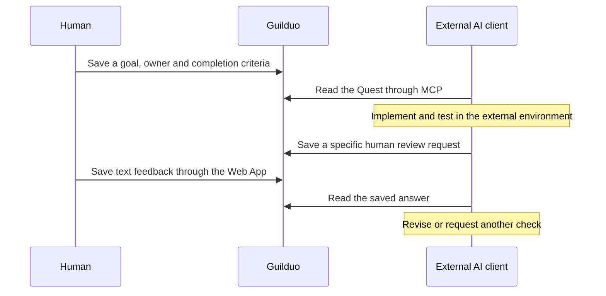

<!-- Unpublished DEV draft. The maker must review factual claims, voice and diagrams before posting. -->

An external coding agent can change a mobile menu, but a person may still need to decide whether it feels usable on a phone. That answer needs a place beside the goal, the owner and the definition of done. A chat message can carry the answer; a shared work record helps explain which task it belongs to and what happens next.

This article uses Guilduo's public source to explain one design: keep the original work and the human review request as separate, connected tasks. It is an explanation from the Guilduo development side. The mobile-menu story below is an illustrative example, not a customer case study or a measured productivity result.

## Separate the task interface from the execution environment

Guilduo is a workspace where humans and external AI agents share Quests, ownership and handoffs. An MCP client can read and update that work through the permitted tools. The model, editor, file changes and test runner remain in the client's environment.

Registering an Agent or assigning a Quest does not launch a model. A Guilduo handoff represents persisted task ownership and progress; it is different from an SDK handoff that transfers execution control to another agent.



The boundary keeps a task status from pretending to be an execution scheduler. Updating `working` tells other participants where the work stands. It does not prove that a model is running or that the implementation succeeded.

## Ask for a check with a concrete answer

Consider a Quest to improve a phone menu. Its completion criteria might require working open/close behavior, no overlap with page content, and a recorded human check on a real device. The coding agent can perform its own tests, then ask the person to evaluate what those tests do not settle.

The `request_human_review` tool creates a separate human confirmation Quest for work assigned to an Agent. The request describes why a person is needed, what to inspect and what a sufficient answer looks like.

This is a tool-argument preview example. `example-quest-id` is a placeholder. No tool was executed to prepare this article.

```json
{
  "questId": "example-quest-id",
  "requestKey": "mobile-menu-review-1",
  "title": "Check the mobile menu on your phone",
  "reason": "Touch comfort and overlap need a real-device decision",
  "checkTarget": "Open and close the preview menu, then follow its links",
  "completionCriteria": "Reply with the device, any problems and the changes needed",
  "dryRun": true
}
```

After reviewing the preview, an actual write supplies the source Quest's current `expectedUpdatedAt` and `dryRun: false`. A stale view of the source task should not silently overwrite a newer situation. Reuse a `requestKey` only for the same request.

The useful detail is the question. “Please review” leaves the reader to infer the target and the expected response. “On your phone, open and close the preview menu and report any content overlap” explains a bounded next action.

Artifacts stay in the normal working environment. Guilduo carries the work request, progress and text feedback; it does not claim to host the editor or run the coding model.

## An answer is not the same as accepting or completing the work

The public contract distinguishes three events:

| Event | What it means |
| --- | --- |
| Human saves a review answer | The requested person's decision is recorded through Web authentication |
| Handoff becomes `accepted` | The work handoff is accepted |
| Original Quest is completed | The original definition of done has been accepted |

Opening, seeing or deferring a request is not an answer. Saving an answer does not automatically complete the source Quest. The agent reads the persisted response through `list_human_requests` before deciding whether to revise, ask again or proceed. It must not invent a human answer.

Handoff states include `ready`, `working`, `blocked`, `review_required` and `accepted`. A transition uses the current `expectedState` to guard the expected prior state. The state and the note give the next participant context; neither is evidence that an external action has already happened.

## Preview writes within the connection's permissions

Assignment and human-review requests can be previewed before saving. Previewing does not increase permissions. The connection's OAuth scopes and the linked Agent's permitted Quest operations both matter.

A read-only connection should not be described as capable of creating tasks. Secrets do not belong in a task or a review answer. Connection recipes vary by MCP client, so the maintained [MCP guide](https://guilduo.com/docs/en/mcp-connection/) and [permissions guide](https://guilduo.com/docs/en/permissions/) are better references than several copied configurations in this article.

## Where this pattern fits

This arrangement is useful when an individual developer works with external AI tools and remains responsible for device checks, design decisions and final acceptance. A later session can read the goal, criteria, owner and saved feedback as a starting point. That is not a promise to restore the whole conversation, editor state or execution context.

Autonomous model scheduling, SDK-level execution transfer and automatic synchronization with external productivity services are different requirements. Check the actual shipped scope rather than treating every “AI workflow” product as interchangeable.

A small first experiment is enough: create one Quest, delegate one bounded change and return one specific human answer.

- [MCP task management for humans and AI agents](https://guilduo.com/solutions/en/mcp-task-management/)
- [AI agent handoff and human review](https://guilduo.com/solutions/en/ai-agent-handoff/)
- [Guilduo](https://guilduo.com/) — public beta, open source under AGPL-3.0-only

## Sources and verification boundary

This explanation is based on public revision `42caab0fa1f396f15e4e1277f6e36dda1ac9bd04`:

- [MCP tool contracts](https://github.com/ELRdn/Guilduo/blob/42caab0fa1f396f15e4e1277f6e36dda1ac9bd04/api/mcp-tools.json)
- [Human confirmation requests](https://github.com/ELRdn/Guilduo/blob/42caab0fa1f396f15e4e1277f6e36dda1ac9bd04/server/human-requests.ts)
- [Agent Registry and Handoff specification](https://github.com/ELRdn/Guilduo/blob/42caab0fa1f396f15e4e1277f6e36dda1ac9bd04/PROJECT_SPEC.md)

The example workflow was not executed while preparing this draft. Any later hands-on validation should be reported with its date and environment, rather than implied by the diagram.
