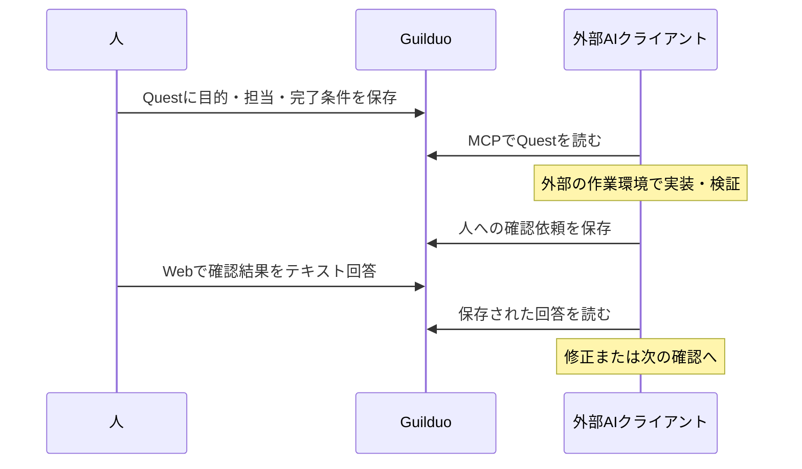

<!-- Zenn向け未投稿原稿。公開前に開発者本人が内容・語り口・図を確認する。 -->

外部のAIコーディングツールへ作業を依頼しても、人の確認が必要になる場面は残ります。スマホのメニューなら、コードの修正だけでなく「実機で押しやすいか」という判断が必要です。その回答をチャットで受け取るだけでは、元の依頼や担当、完了条件との対応が薄くなることがあります。

ここではGuilduoの公開コードを材料に、**作業を表すQuestと、人への確認依頼を分けて管理する設計**を説明します。Guilduo開発側からの解説原稿です。以下は説明用の例で、実際の顧客事例や性能測定ではありません。

## MCPの接続と、作業の実行を分ける

Guilduoは、人と外部AI Agentがタスクを依頼し、担当し、引き継ぐワークスペースです。MCPはAIクライアントがその作業データを読み書きする接続手段になります。

一方、モデル、IDE、ファイル編集、テストの実行は接続元が担当します。Agentを登録したり、Questを割り当てたりしただけで、Guilduoがモデルを起動するわけではありません。



この境界を先に決めると、「共有したい作業状態」と「Agentの実行状態」を同じものとして扱わずに済みます。GuilduoのHandoffはタスクの担当・進捗・受け渡し状態で、SDKがAgent間の実行制御を移すHandoffとは役割が異なります。

## 元の仕事と確認依頼は、別のQuestにする

例として、元のQuestを次のようにします。

| 項目 | 説明用の値 |
| --- | --- |
| 目的 | スマホのメニューを使いやすくする |
| 担当 | 接続した実装Agent |
| 完了条件 | メニューが開閉でき、本文に重ならず、人の実機確認が残る |
| 確認対象 | 公開プレビューのメニューとリンク |

Agentがブラウザで確認できる範囲と、人が手元の端末で判断する範囲は違います。そこでAgentは、元Questを完了させる代わりに確認依頼を作ります。

Guilduoの `request_human_review` は、Agent担当の元Questに対して別の人間向け確認Questを作るツールです。確認対象、確認が必要な理由、回答の完了条件を明示できます。

以下は**ツール引数のプレビュー例**です。`example-quest-id` は実際のIDへ置き換える値で、この原稿を作成するためにツールは実行していません。

```json
{
  "questId": "example-quest-id",
  "requestKey": "mobile-menu-review-1",
  "title": "スマホでメニューの操作感を確認してください",
  "reason": "押しやすさと本文との重なりは実機で判断したい",
  "checkTarget": "プレビューのメニュー開閉とリンク移動",
  "completionCriteria": "端末名、問題の有無、修正が必要な箇所をテキストで回答する",
  "dryRun": true
}
```

保存時はプレビューを確認し、元Questの現在の `expectedUpdatedAt` と `dryRun: false` を指定します。元Questが別の操作で変わっていた場合、古い状態を前提にそのまま書き込みません。同じ `requestKey` の再利用は、同一の確認依頼に限ります。

「見ておいて」より、どの画面・何の判断・どの回答が必要かを短く書くほうが、受け取った人が動きやすくなります。成果物自体はいつもの作業環境で確認し、Guilduoへ戻すのは依頼・進捗・テキスト回答です。

## 人の回答、Handoff受理、仕事の完了を分ける

公開契約では次の操作を区別しています。

| 操作 | 意味 |
| --- | --- |
| 人が確認依頼へ回答 | 人の判断を、認証されたWeb操作で保存する |
| Handoffを `accepted` にする | 担当間の受け渡しを受理する |
| 元Questを完了する | 元の仕事の完了条件を満たしたと判断する |

確認画面を開いた、既読にした、保留にした、というだけでは回答になりません。回答が保存されても元Questは自動完了しません。Agentは `list_human_requests` で保存された回答を読み、内容に応じて修正・再確認・受け入れへ進みます。人の回答をAgentが推測して埋めないことも、この契約の一部です。

Handoffには `ready`、`working`、`blocked`、`review_required`、`accepted` などの状態があります。例えば実装中は `working`、確認を求めるなら `review_required` として次の担当に必要な説明を添えます。状態変更には現在の `expectedState` を使い、変更そのものをモデル起動のトリガーとは扱いません。

## 書き込み前のプレビューと権限

担当割り当てや人への確認依頼はプレビューしてから保存します。プレビューは意図する操作を確認するためのもので、OAuth権限を増やす機能ではありません。

接続元のOAuth許可と、リンクしたAgentのQuest操作権限の両方を確認する必要があります。読み取りだけを許可した接続で、書き込みできると説明してはいけません。APIキーや認証tokenをQuestやチャットへ貼り付ける必要もありません。

接続方法はクライアントによって異なるため、この設計記事で設定を何種類も複製せず、[MCP接続ガイド](https://guilduo.com/docs/mcp-connection/)と[権限ガイド](https://guilduo.com/docs/permissions/)を正本として参照します。

## この構成が向く場面

外部AIで実装し、自分で実機やデザインを確認する個人開発には、このような共有タスクと確認依頼の分離が適しています。実装のセッションが変わったときも、作業に戻る際に目的・完了条件・担当・保存された回答を読み直す入口になります。ただし、会話履歴やIDE状態の完全な復元を保証するものではありません。

自律的なモデル実行基盤、SDKの実行移譲、Google CalendarやNotionとの自動同期を求める場合は、それぞれ別の提供範囲を確認する必要があります。

まず小さなQuestを1つ作り、AIへ依頼し、具体的な人の確認を1回戻してみるところから始められます。

- [MCPでつなぐ、人とAIエージェントのタスク管理](https://guilduo.com/solutions/mcp-task-management/)
- [人とAIエージェントの引き継ぎとレビュー](https://guilduo.com/solutions/ai-agent-handoff/)
- [Guilduo公式サイト](https://guilduo.com/)

## 公開コードと確認範囲

説明は公開リポジトリの `42caab0fa1f396f15e4e1277f6e36dda1ac9bd04` を基準にしています。

- [MCPツールの入出力契約](https://github.com/ELRdn/Guilduo/blob/42caab0fa1f396f15e4e1277f6e36dda1ac9bd04/api/mcp-tools.json)
- [Human確認依頼の処理](https://github.com/ELRdn/Guilduo/blob/42caab0fa1f396f15e4e1277f6e36dda1ac9bd04/server/human-requests.ts)
- [Agent登録・Handoffの仕様](https://github.com/ELRdn/Guilduo/blob/42caab0fa1f396f15e4e1277f6e36dda1ac9bd04/PROJECT_SPEC.md)

この原稿の説明用操作は実行していません。公開前に開発者本人が内容を確認し、操作を追加検証する場合は実施日と対象環境を追記します。
